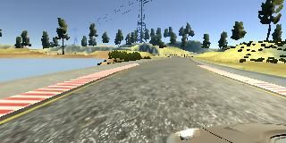
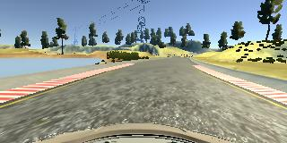
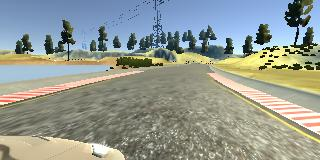
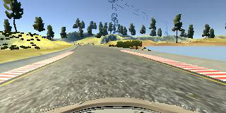
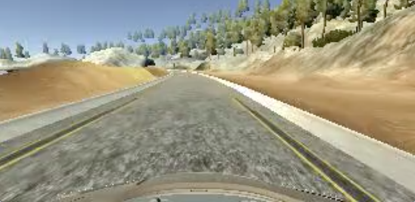

# Behavioral Cloning


### Behavioral Cloning Project

The goals / steps of this project are the following:
* Use the simulator to collect data of good driving behavior
* Build, a convolution neural network in Keras that predicts steering angles from images
* Train and validate the model with a training and validation set
* Test that the model successfully drives around track one without leaving the road
* Summarize the results with a written report

---
### Rubric Points
Here I will consider the [rubric points](https://review.udacity.com/#!/rubrics/432/view) individually and describe how I addressed each point in my implementation.  

---
### Files Submitted & Code Quality

#### 1. Submission includes all required files and can be used to run the simulator in autonomous mode

My project includes the following files:
* `data.py` containing the script to load data , preprocess image , augment data and the batch generator
* `model.py` containing the script to create,train and save the model
* `drive.py` for driving the car in autonomous mode
* `model.h5` containing a trained convolution neural network 
* `writeup_report.md` summarizing the results

#### 2. Submission includes functional code
Using the Udacity provided simulator and my drive.py file, the car can be driven autonomously around the track by executing 
```sh
python drive.py model.h5
```

#### 3. Submission code is usable and readable

The `model.py` file contains the code for training and saving the convolution neural network. The file shows the pipeline I used for training and validating the model, and it contains comments to explain how the code works.

### Model Architecture and Training Strategy

#### 1. An appropriate model architecture has been employed

My model consists of a convolution neural network with 3x3 filter sizes and depths 16,32,64 (model.py lines 23-27) 

The model includes RELU layers to introduce nonlinearity and the data is normalized in the model using a Keras lambda layer (code line 22). 


#### 2. Attempts to reduce overfitting in the model

The model contains dropout layers in order to reduce overfitting (model.py lines 31,33). 

The model was trained and validated on different data sets to ensure that the model was not overfitting. The model was tested by running it through the simulator and ensuring that the vehicle could stay on the track. The training loss and validation loss during the training gave a very easy way to identify the overfitting issue. Whenever the train loss is substantially less than the validation loss then it a very good case of overfitting.

#### 3. Model parameter tuning

The model used an adam optimizer, so the learning rate was not tuned manually (model.py line 36). I did work with different values for the Convolution layer depth and the training batch size and the values used gave me good results.

#### 4. Appropriate training data

Training data was chosen to keep the vehicle driving on the road. I used a combination of center lane driving, recovering from the left and right sides of the road and driving in the opposite direction. 

My initial runs had issue with the sharp turns, to overcome this I captured data specifically at the sharp curves multiple times so that I have good amount of data at these points.

For details about how I created the training data, see the next section. 

### Model Architecture and Training Strategy

#### 1. Solution Design Approach

The overall strategy for deriving a model architecture was to use an existing, tried and tested model and do the necessary simplications/modifications to suit the requirement. 

I started with the LeNet model and did a few training runs. The simplicity of the model helped me to understand the entire workflow and see how the car was driving with the recorded data. And then I moved to a more robust NVIDIA model. I finally settled with a modified version of the NIVIDIA model.

In order to gauge how well the model was working, I split my image and steering angle data into a training and validation set. I then monitored the train & validation loss to see if they are diverging significantly implying overfitting. With the good amount of training data and the Dropout Layers, the training ran without any overfitting issue.

The final step was to run the simulator to see how well the car was driving around track one. I did have a few issues initially.
1. There were a few spots where the vehicle fell off the track initially. To improve the driving behavior in these cases, I captured data specifically at the sharp curves multiple times.
2. The car was driving on the right lane marker and also there is a bias for the car to be towards the right lane marker. To overcome this , I captured data by driving in the opposite direction.

At the end of the process, the vehicle is able to drive autonomously around the track without leaving the road.

#### 2. Final Model Architecture

The final model architecture (model.py lines 18-24) consisted of a convolution neural network with the following layers and layer sizes. The input to the model is of the shape (None, 32, 128, 3). 

|Layer (type)                 |Output Shape              |Param #   
|:-------------------------------- |:-------------------| --------:|
|lambda_1 (Lambda)            |(None, 32, 128, 3)        |0         
|conv2d_1 (Conv2D)            |(None, 30, 126, 16)       |448       
|max_pooling2d_1 (MaxPooling2 |(None, 15, 63, 16)        |0         
|conv2d_2 (Conv2D)            |(None, 13, 61, 32)        |4640      
|max_pooling2d_2 (MaxPooling2 |(None, 6, 30, 32)         |0         
|conv2d_3 (Conv2D)            |(None, 4, 28, 64)         |18496     
|max_pooling2d_3 (MaxPooling2 |(None, 2, 14, 64)         |0         
|flatten_1 (Flatten)          |(None, 1792)              |0         
|dense_1 (Dense)              |(None, 500)               |896500    
|dropout_1 (Dropout)          |(None, 500)               |0         
|dense_2 (Dense)              |(None, 100)               |50100     
|dropout_2 (Dropout)          |(None, 100)               |0         
|dense_3 (Dense)              |(None, 20)                |2020      
|dense_4 (Dense)              |(None, 1)                 |21        
|

Total params: 972,225

Trainable params: 972,225

Non-trainable params: 0


```python

#model.py

model = Sequential()
model.add(Lambda(lambda x:x/255-0.5,input_shape=(32,128,3)))
model.add(Conv2D(16, (3, 3), activation='relu', input_shape=(32, 128, 3)))
model.add(MaxPooling2D(pool_size=(2, 2)))
model.add(Conv2D(32, (3, 3), activation='relu'))
model.add(MaxPooling2D(pool_size=(2, 2)))
model.add(Conv2D(64, (3, 3), activation='relu'))
model.add(MaxPooling2D(pool_size=(2, 2)))
model.add(Flatten())
model.add(Dense(500, activation='relu'))
model.add(Dropout(.5))
model.add(Dense(100, activation='relu'))
model.add(Dropout(.25))
model.add(Dense(20, activation='relu'))
model.add(Dense(1))
model.compile(optimizer=Adam(lr=1e-04), loss='mean_squared_error')
```


#### 3. Creation of the Training Set & Training Process

To capture good driving behavior, I first recorded two laps on track one using center lane driving. Here is an example image of center lane driving:

<table>
<tbody>
<tr>
<td> Left Cam Image 
<td> Center Cam Image
<td> Right Cam Image 
</tbody>
</table>

I then recorded 2 laps by driving in the opposite direction. This will help in getting data that will balance the steering angles being biased to any one direction. Also it will help to get a new set of data for training.

Due to time constrains, I did not train the model on track two as I was going to test only on the first track and the data from track one provided me good results for track one testing. I will be working on track two after the submission.


After the collection process, I had 6068 data points in the driving_log.csv file. I augmented this data using the below techniques.

1. **Including Left and Right images :** I added the left and right images and adjusted the steering angle by adding +0.25 (left) & -0.25 (right) to the existing steering value. I selected random 50% data for left and another random 50% for the right images. 

```python

#data.py: get_csv_data()

# Indices of random 50% sample of the data
ileft = np.random.choice(count,count,replace=False)
iright = np.random.choice(count,count//2,replace=False)

data=driving_log[:,[CENTER,STEERING,THROTTLE,BRAKE,SPEED]]

left_data=driving_log[:,[LEFT,STEERING,THROTTLE,BRAKE,SPEED]] [ileft , :]
right_data=driving_log[:,[RIGHT,STEERING,THROTTLE,BRAKE,SPEED]] [iright , :]

left_data[:,[STEERING]]=left_data[:,[STEERING]] + 0.25
right_data[:,[STEERING]]=right_data[:,[STEERING]] - 0.25

```

2. **Flipping Data :** To further augment the data , I flipped images and angles thinking that this would increase the data available for training as well as help in balancing the right vs the left steering angles in the sample. For example,here is an image that has then been flipped:

<table>
<tbody>
<tr>
<td> Actual Iamge 
<td> Flipped Image 
</tbody>
</table>

For each batch in the generator, I added a flipped set of the current batch. So the generator would generate a batch with twice the batch size data. The image pixels are flipped and the steering angle is also adjusted by multiplying -1.


```python

#data.py : get_batch_data()

for row in batch:
    image = preprocess_image(plt.imread( "SimulatorTraining/" + row[IMG]))
    angle = row[STEERING]
    x.append( image )
    y.append( angle )
    x.append( image[:,::-1,:] ) # Flip Image
    y.append( -1 * angle ) #Adjust Steering angle
```

A couple of other augmentation techniques can be considered in some other scenerios. But these are not used here as I think these techniques will not add much value in the current problem scenerio. The other augmentation techniques like below.
1. Random shifting the top,bottom,left and right while cropping
2. Altering the image brightness to create an images that can be used a night images
3. Adding random shadows to images.

I preprocessed the image in each data point by calling the `preprocess_image()` on the image. This will crop the image to remove the top and bottom regions that are clutter for the learning model. Then this image is resized to 128x32 size

```python

def preprocess_image(image):

    image = image[70:140,:,:]
    image = cv2.resize(image,(128,32))

    return image
```

I finally randomly shuffled the dataset and put 20% of the data into a validation set and rest 80% in the training set

```python
#data.py : get_csv_data()

np.random.shuffle(data)

train, valid  = model_selection.train_test_split(data, test_size=.2)

```

I used this training data for training the model. The validation set helped determine if the model was over or under fitting. The ideal number of epochs was 25 as evidenced by training and the validation loss. I used an adam optimizer so that manually training the learning rate wasn't necessary.

```
Epoch 1/25
75/75 [==============================] - 171s - loss: 0.0169 - val_loss: 0.0145
Epoch 2/25
75/75 [==============================] - 137s - loss: 0.0150 - val_loss: 0.0122
Epoch 3/25
75/75 [==============================] - 101s - loss: 0.0132 - val_loss: 0.0113
Epoch 4/25
75/75 [==============================] - 97s - loss: 0.0125 - val_loss: 0.0110
Epoch 5/25
75/75 [==============================] - 120s - loss: 0.0118 - val_loss: 0.0109
Epoch 6/25
75/75 [==============================] - 134s - loss: 0.0117 - val_loss: 0.0108
Epoch 7/25
75/75 [==============================] - 124s - loss: 0.0114 - val_loss: 0.0108
Epoch 8/25
75/75 [==============================] - 122s - loss: 0.0113 - val_loss: 0.0106
Epoch 9/25
75/75 [==============================] - 157s - loss: 0.0111 - val_loss: 0.0105
Epoch 10/25
75/75 [==============================] - 159s - loss: 0.0110 - val_loss: 0.0104
Epoch 11/25
75/75 [==============================] - 168s - loss: 0.0107 - val_loss: 0.0103
Epoch 12/25
75/75 [==============================] - 106s - loss: 0.0107 - val_loss: 0.0102
Epoch 13/25
75/75 [==============================] - 103s - loss: 0.0103 - val_loss: 0.0101
Epoch 14/25
75/75 [==============================] - 100s - loss: 0.0105 - val_loss: 0.0101
Epoch 15/25
75/75 [==============================] - 107s - loss: 0.0103 - val_loss: 0.0100
Epoch 16/25
75/75 [==============================] - 98s - loss: 0.0101 - val_loss: 0.0099
Epoch 17/25
75/75 [==============================] - 102s - loss: 0.0101 - val_loss: 0.0099
Epoch 18/25
75/75 [==============================] - 113s - loss: 0.0099 - val_loss: 0.0099
Epoch 19/25
75/75 [==============================] - 198s - loss: 0.0098 - val_loss: 0.0098
Epoch 20/25
75/75 [==============================] - 151s - loss: 0.0096 - val_loss: 0.0097
Epoch 21/25
75/75 [==============================] - 119s - loss: 0.0096 - val_loss: 0.0097
Epoch 22/25
75/75 [==============================] - 129s - loss: 0.0094 - val_loss: 0.0096
Epoch 23/25
75/75 [==============================] - 137s - loss: 0.0093 - val_loss: 0.0095
Epoch 24/25
75/75 [==============================] - 136s - loss: 0.0091 - val_loss: 0.0095
Epoch 25/25
75/75 [==============================] - 182s - loss: 0.0090 - val_loss: 0.0095
```

#### 4. Output Video

The outout video is generated by running the video.py on the camera images generated during the autonomous driving.

```
$ python drive.py model.h5 runs/run4
$ python video.py runs/run4
```


[](https://youtu.be/zI6V8Kzvbl0)

[https://youtu.be/zI6V8Kzvbl0](https://youtu.be/aeVMiOCsowE)